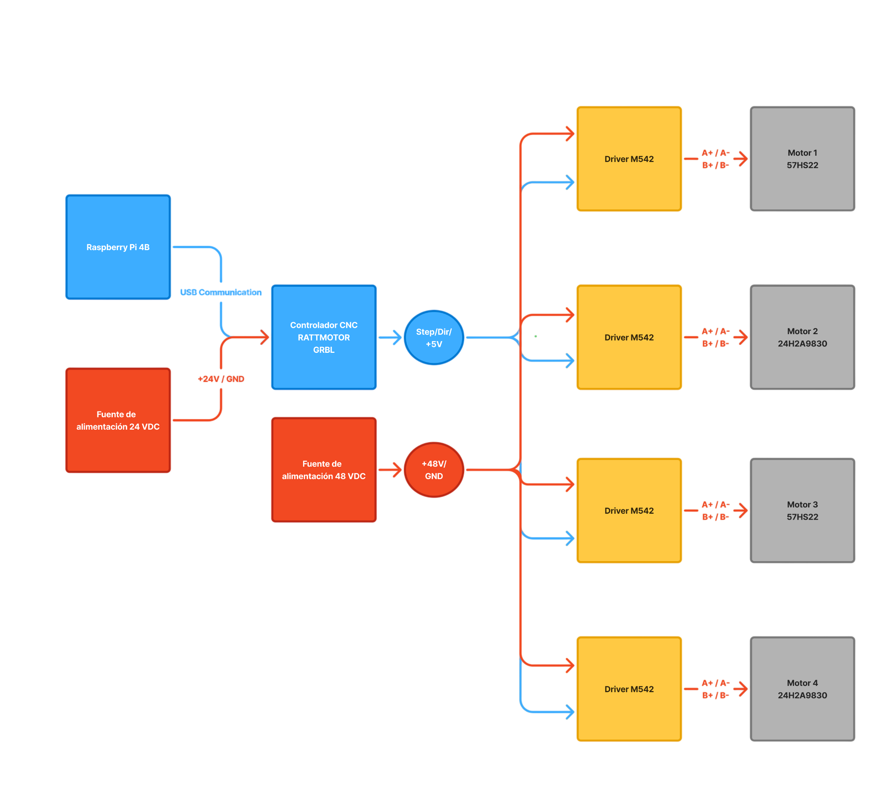

---
<h1 align="center">
  Cortadora de polifan CNC orientada a protoripos de alas de aviones livianos
</h1>

  <b>Practica profesional supervisada - Ingeniería Mecatrónica</b> 
  <b>Facultad de Ingeniería - Universidad nacional de Lomas de zamora</b> 
  <b>Coluccio Valentin - 1C 2026 </b>

---

# 📑 Índice
1. [Introducción](#-introducción)
2. [Objetivo](#-objetivo)
3. [Descripción técnica](#-descripción-técnica)
4. [Tecnologías utilizadas](#-tecnologías-utilizadas)
5. [Listado de componentes](#-listado-de-componentes)
6. [Esquemáticos](#-esquemáticos)
7. [Fotos](#-fotos)
8. [Instrucciones de uso](#-instrucciones-de-uso)
9. [Estructura del repositorio](#-estructura-del-repositorio)
10. [Autor](#-autor)
---

# 📌 Introducción
El presente repositorio documenta el desarrollo de una **Práctica Profesional Supervisada (PPS – 2026, 1.º cuatrimestre)**, realizada en el área del modelismo aeronáutico.

Dentro del proceso de diseño y fabricación de aeronaves a escala, una de las etapas más importantes es la construcción de las alas. Estas suelen fabricarse a partir de núcleos de poliestireno expandido (EPS, comúnmente denominado telgopor o polifan), los cuales posteriormente son mecanizados y recubiertos con materiales compuestos, como fibra de vidrio o fibra de carbono, para obtener la geometría y resistencia estructural requeridas.

Actualmente, la oferta de máquinas destinadas al corte de núcleos alares es limitada. Las soluciones comerciales disponibles suelen presentar costos elevados, áreas de trabajo reducidas o requerir desarrollos específicos para cada aplicación. Como consecuencia, gran parte de los fabricantes y aficionados recurren a equipos personalizados o a procesos manuales, lo que incrementa los tiempos de producción y reduce la repetibilidad de los resultados.

# 🎯 Objetivo
El objetivo del presente proyecto fue diseñar y desarrollar una máquina de corte por hilo caliente controlada numéricamente (CNC), destinada a la fabricación de perfiles y núcleos alares de poliestireno expandido.

Tomando como punto de partida un diseño conceptual desarrollado aproximadamente diez años atrás, se realizó el rediseño integral de la estructura mecánica, el sistema de accionamiento, la electrónica de control y la arquitectura de software necesarias para su funcionamiento. El alcance del proyecto incluyó la construcción y puesta en marcha de la máquina, quedando excluido únicamente el desarrollo definitivo del sistema de calentamiento del hilo de corte.

# ⚙️ Descripción técnica
La máquina desarrollada consiste en una cortadora CNC de hilo caliente de cuatro ejes, diseñada para el mecanizado de piezas de poliestireno expandido (EPS) utilizadas principalmente en la fabricación de alas para aeromodelismo.

El sistema emplea un hilo resistivo calentado eléctricamente que funde el material durante el avance, permitiendo obtener perfiles de alta precisión sin generar esfuerzos mecánicos significativos sobre la pieza.

La estructura mecánica está compuesta principalmente por perfilería y placas de aluminio, seleccionadas por su adecuada relación entre rigidez, resistencia mecánica y bajo peso. Adicionalmente, los soportes de los motores fueron fabricados mediante impresión 3D e incorporan insertos roscados metálicos para asegurar una fijación confiable y facilitar las tareas de montaje y mantenimiento.

El sistema dispone de cuatro ejes lineales independientes accionados por motores paso a paso, permitiendo controlar de manera individual la posición de ambos extremos del hilo de corte. Esta configuración posibilita la fabricación de perfiles alares de geometría variable y la realización de cortes complejos, donde la forma de un extremo de la pieza puede diferir de la del otro.

El control de movimiento se realiza mediante una Raspberry Pi 4B y una controladora CNC compatible con GRBL, encargadas de interpretar trayectorias definidas en código G y coordinar los desplazamientos de los distintos ejes. La electrónica de potencia está compuesta por controladores externos para motores paso a paso y una fuente de alimentación de corriente continua para el sistema.

El diseño fue concebido con una filosofía modular, permitiendo futuras mejoras tanto en la estructura mecánica como en los sistemas de control y automatización.

# 🧰 Tecnologías utilizadas

Durante el desarrollo del proyecto se emplearon distintas tecnologías de diseño, fabricación, control y asistencia técnica:

| Tecnología                                                    | Aplicación                                                                                                                               |
| ------------------------------------------------------------- | ---------------------------------------------------------------------------------------------------------------------------------------- |
| CATIA                                                         | Diseño y modelado de componentes mecánicos de la máquina.                                                                                |
| SolidWorks                                                    | Modelado y validación de conjuntos mecánicos específicos.                                                                                |
| Autodesk Fusion 360                                           | Diseño de piezas y generación de trayectorias de mecanizado (CAM) para la fabricación de componentes.                                    |
| Manufactura CNC                                               | Fabricación de placas y componentes estructurales de aluminio a partir de los diseños CAD.                                               |
| Impresión 3D                                                  | Fabricación de soportes de motores y piezas auxiliares de montaje.                                                                       |
| Raspberry Pi 4B                                               | Plataforma de control utilizada para la ejecución del software CNC.                                                                      |
| Linux                                                         | Sistema operativo empleado en la Raspberry Pi para la ejecución y administración del sistema.                                            |
| GRBL                                                          | Firmware encargado de interpretar el código G y controlar el movimiento de los ejes.                                                     |
| Código G                                                      | Lenguaje utilizado para definir las trayectorias y operaciones de mecanizado.                                                            |
| Inteligencia Artificial Generativa (ChatGPT, Gemini y Claude) | Herramientas de asistencia utilizadas durante las etapas de diseño, investigación, resolución de problemas y documentación del proyecto. |

# 📦 Listado de componentes

| Componente                        | Cantidad     | Descripción                                       |
| --------------------------------- | ------------ | ------------------------------------------------- |
| Raspberry Pi 4B                   | 1            | Sistema principal de control.                     |
| Controladora CNC GRBL (RATTMOTOR) | 1            | Generación de señales STEP/DIR para los ejes.     |
| Driver M542                       | 4            | Control de potencia para motores paso a paso.     |
| Motor paso a paso 57HS22          | 2            | Accionamiento de los ejes principales.            |
| Motor paso a paso 24H2A9830       | 2            | Accionamiento de los ejes secundarios.            |
| Fuente de alimentación 48 VCC     | 1            | Alimentación de los drivers y motores.            |
| Fuente de alimentación 24 VCC     | 1            | Alimentación de la controladora CNC.              |
| Tornillos de avance               | 4            | Conversión de movimiento rotacional a lineal.     |
| Guías lineales                    | 8            | Guiado y posicionamiento de los carros móviles.   |
| Rodamientos lineales              | 16           | Desplazamiento de los carros sobre las guías.     |
| Acoples flexibles                 | 4            | Acoplamiento entre motores y tornillos de avance. |
| Perfilería de aluminio            | Según diseño | Estructura principal de la máquina.               |
| Placas de aluminio mecanizadas    | Varias       | Uniones estructurales, soportes y carros móviles. |
| Piezas impresas en 3D             | Varias       | Soportes de motores y componentes auxiliares.     |

> **Nota:** Las cantidades y dimensiones exactas de los elementos mecánicos pueden variar según la configuración y el área útil de trabajo.

# 📐 Esquemático

A continuación se presenta el diagrama general del sistema desarrollado. En él se muestran los principales componentes de la arquitectura de control, alimentación y accionamiento de la máquina, así como las interconexiones entre ellos.

# 🖼️ Fotos
# 📝 Instrucciones de uso
# 📁 Estructura del repositorio
# 👤 Autor

